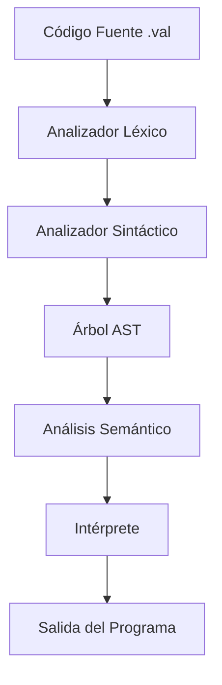

# Documentación Técnica del Compilador Valorant

## Arquitectura del Compilador

El compilador Valorant está implementado siguiendo una arquitectura de múltiples fases:

1. **Análisis Léxico** (Flex)
2. **Análisis Sintáctico** (Bison)
3. **Análisis Semántico** (AST)
4. **Interpretación** (Ejecución directa)

### Diagrama de Componentes



## 1. Análisis Léxico (valorant.l)

### Tokens Definidos
- Palabras clave: `agent`, `spike`, `plant`, `flash`, `smoke`, `rotate`
- Tipos: `sage`, `viper`, `cypher`
- Operadores: `heal`, `damage`, `kill`, `share`, `win`, `lose`, `headshot`
- E/S: `breach`, `sova`
- Símbolos: `{`, `}`, `(`, `)`, `;`, `=`
- Literales: números enteros, decimales, cadenas

### Manejo de Errores Léxicos
- Caracteres no reconocidos
- Cadenas sin cerrar
- Números mal formados

## 2. Análisis Sintáctico (valorant.y)

### Gramática
```yacc
program : function_list
        ;

function_list : function
              | function_list function
              ;

function : AGENT IDENTIFIER '(' param_list ')' block
         ;

block : '{' statement_list '}'
      ;

statement_list : statement
               | statement_list statement
               ;

statement : declaration
          | assignment
          | if_statement
          | while_statement
          | return_statement
          | io_statement
          ;

// ... más reglas gramaticales ...
```

### Manejo de Errores Sintácticos
- Paréntesis/llaves sin cerrar
- Errores de secuencia de tokens
- Declaraciones incompletas

## 3. Árbol de Sintaxis Abstracta (AST)

### Tipos de Nodos
```c
typedef enum {
    NODE_NUMBER,
    NODE_STRING,
    NODE_IDENTIFIER,
    NODE_BINARY_OP,
    NODE_IF,
    NODE_WHILE,
    NODE_BLOCK,
    NODE_DECLARATION,
    NODE_OUTPUT,
    // ... otros tipos
} NodeType;
```

### Estructura de Nodos
```c
typedef struct ASTNode {
    NodeType type;
    union {
        int number;
        char* string;
        struct {
            struct ASTNode* left;
            struct ASTNode* right;
            int op;
        } binary;
        // ... otros tipos de valores
    } value;
    struct ASTNode* next;
} ASTNode;
```

## 4. Intérprete

### Contexto de Ejecución
```c
typedef struct {
    Variable* variables;
    int error_count;
    char error_message[256];
} ExecutionContext;
```

### Tipos de Datos en Tiempo de Ejecución
```c
typedef enum {
    TYPE_SAGE,   // int
    TYPE_VIPER,  // float
    TYPE_CYPHER  // string
} ValueType;

typedef struct {
    ValueType type;
    union {
        int sage_val;
        float viper_val;
        char* cypher_val;
    } value;
} Value;
```

### Manejo de Variables
- Tabla de símbolos implementada como lista enlazada
- Verificación de tipos en tiempo de ejecución
- Gestión de memoria para strings

## Análisis Semántico

### Verificaciones Realizadas
1. **Tipos**
   - Compatibilidad en operaciones
   - Asignaciones válidas
   - Conversiones implícitas

2. **Variables**
   - Declaración antes de uso
   - No redeclaración en el mismo ámbito
   - Inicialización adecuada

3. **Operaciones**
   - División por cero
   - Operadores aplicados a tipos correctos
   - Condiciones booleanas en if/while

## Optimizaciones

### Actuales
- Evaluación de constantes en tiempo de compilación
- Eliminación de código muerto simple

### Futuras Mejoras
1. Propagación de constantes
2. Eliminación de código muerto avanzada
3. Optimización de bucles
4. Análisis de flujo de datos

## Gestión de Memoria

### Estrategias
1. **Asignación**
   - Uso de malloc/free para nodos AST
   - Gestión de strings dinámicos
   - Tabla de símbolos dinámica

2. **Liberación**
   - Limpieza recursiva del AST
   - Liberación de variables al salir de ámbito
   - Manejo de memoria en strings

### Prevención de Fugas
- Seguimiento de asignaciones
- Liberación sistemática en errores
- Verificación con herramientas (valgrind)

## Manejo de Errores

### Niveles de Error
1. **Léxico**: Caracteres y tokens inválidos
2. **Sintáctico**: Estructura del programa incorrecta
3. **Semántico**: Errores de tipos y variables
4. **Ejecución**: Errores en tiempo de ejecución

### Recuperación de Errores
- Modo pánico en errores sintácticos
- Continuación después de errores no fatales
- Limpieza de recursos en errores fatales

## Pruebas

### Suite de Pruebas
1. **Unitarias**
   - Análisis léxico
   - Análisis sintáctico
   - Construcción del AST
   - Interpretación

2. **Integración**
   - Flujo completo del compilador
   - Manejo de errores
   - Casos límite

3. **Ejemplos**
   - FizzBuzz
   - Factorial
   - Calculadora
   - Mayor Número

## Rendimiento

### Métricas
- Tiempo de compilación
- Uso de memoria
- Tiempo de ejecución
- Complejidad del AST

### Limitaciones Actuales
1. Sin optimizaciones avanzadas
2. Interpretación vs compilación
3. Manejo de memoria simple

## Futuras Mejoras

1. **Técnicas**
   - Generación de código nativo
   - Optimizaciones avanzadas
   - Análisis de flujo de datos

2. **Funcionalidad**
   - Más tipos de datos
   - Funciones de biblioteca estándar
   - Módulos y namespaces

3. **Herramientas**
   - Depurador integrado
   - Perfilador
   - Formateo de código

## Referencias

1. Flex Manual: [https://westes.github.io/flex/manual/](https://westes.github.io/flex/manual/)
2. Bison Manual: [https://www.gnu.org/software/bison/manual/](https://www.gnu.org/software/bison/manual/)
3. Dragon Book: Compilers: Principles, Techniques, and Tools
4. Modern Compiler Implementation in C 